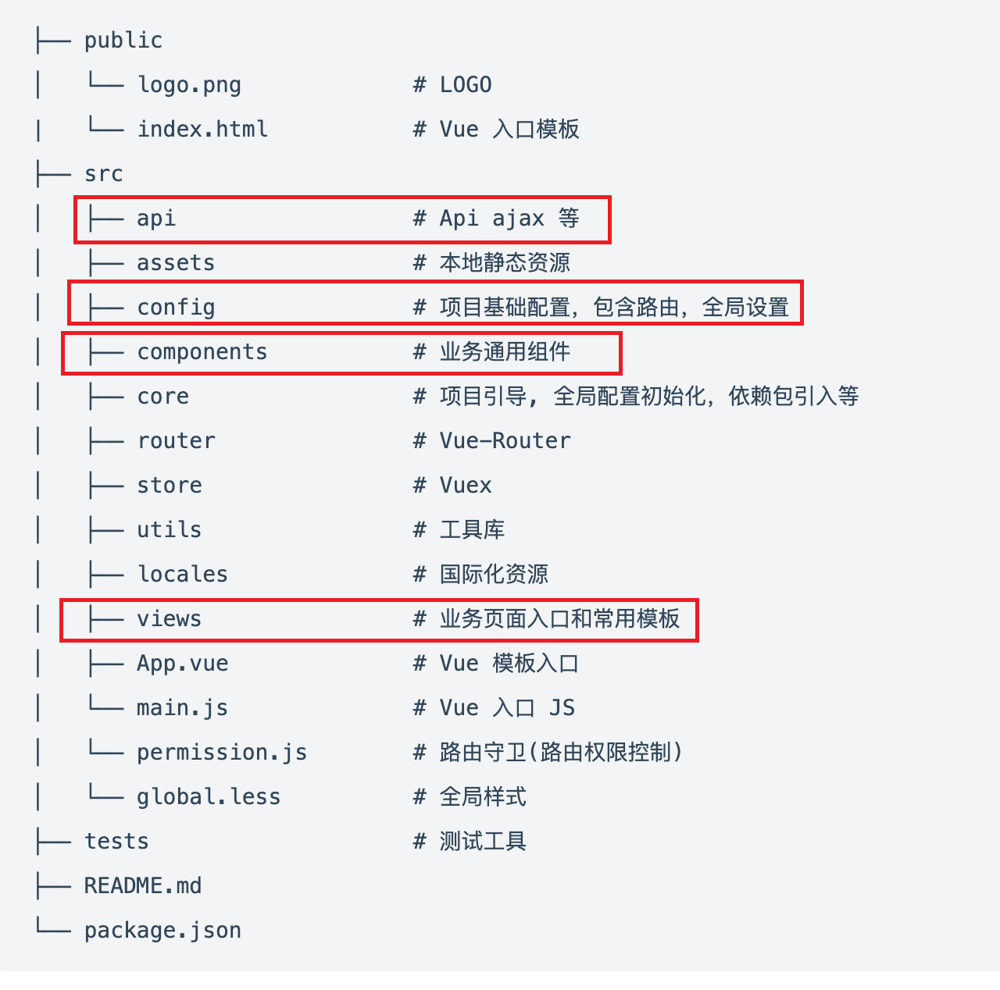

### Project setup
- 提前安装 yarn 和 nvm

```
# 用 nvm 安装 20.12.2 版本的 node 
nvm install 20.12.2 
```

- yarn 在项目中安装依赖
```
yarn install
```

- yarn 本地运行服务
```
yarn run serve
```

### VSCode 开发 
- 安装 `eslint` 插件, 方便检测/修改代码风格以通过 `eslint` 检测

### git
- 尽量避免修改同一个文件
- 先 `commit` 后 `pull`, 之后再 `push` 确保不会和远程冲突

### 项目开发
主要关注 `src` 文件夹中的内容

- `api`, 里面放和后端的请求
- `config`, `router.config.js` 里面控制整体的路由逻辑, 实现新建页面/菜单的功能
- `components`, 放自己自定义的组件, 作为项目中其他页面调用的元素,认为可以被复用的放这里
- `views`, 主要是一整个页面的逻辑, 和 `router.config.js` 中的子菜单一一对应